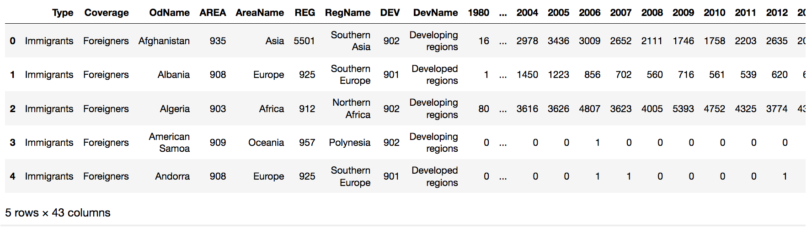

# Data-Visualization-Immigration-to-Canada-Area-Hist-Bar
### by Sushant Deshpande

In this project, I set out to answer 3 questions:
* Which are the top 15 countries countributing to the immigration to Canada?
* Which are the bottom 5 countries with least contribution to immigration in Canada?
* Can we represent this in a choropleth map?

Let's start by importing the data into our Jupyter Notebook. Since the csv file has some info on the top which is occupying around 20 rows, we need to skip them. It also has multiple sheets so we need to specify which sheet to use. In addition, it also has a footer which is of no use to us so we need to ignore that as well. Our code hence would look like this:

    df_can = pd.read_excel('data/Canada.xlsx',
                       sheet_name='Canada by Citizenship',
                       skiprows=range(20),
                       skip_footer=2
                      )

Our data looks like this:

Let's cleanup our data by dropping unwanted rows and renaming some of the column headers.

    df_can.drop(['AREA', 'REG', 'DEV', 'Type', 'Coverage'], axis=1, inplace=True)
    df_can.rename(columns={'OdName':'Country', 'AreaName':'Continent','RegName':'Region'}, inplace=True)

Since our column labels have numbers in them, there might be a chance that they are not strings. This could cause issues in our analysis. Let us first make sure that they are all strings and if not, then convert them to strings.

    df_can.columns = list(map(str, df_can.columns))
    all(isinstance(column, str) for column in df_can.columns)

And also let us set the countries as index. This will be useful for quickly looking up countries using .loc method.

Right now, we have the data/number of immigrants per year. So let us make a *Total* column which adds them all.

    df_can['Total'] = df_can.sum(axis=1)

Now, our data prep is almost complete and we can start plotting and visualizing the data.